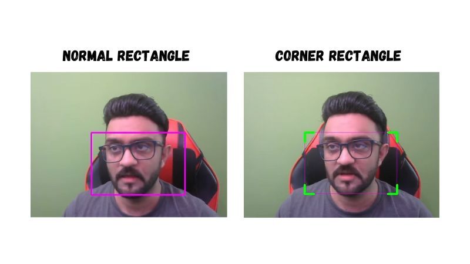
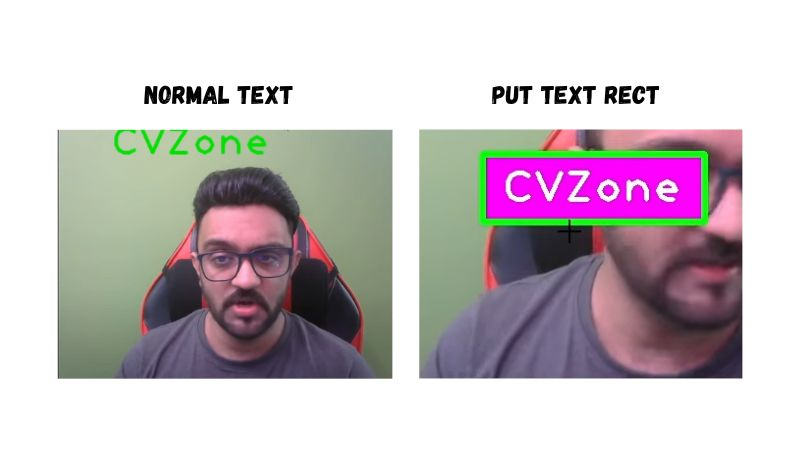
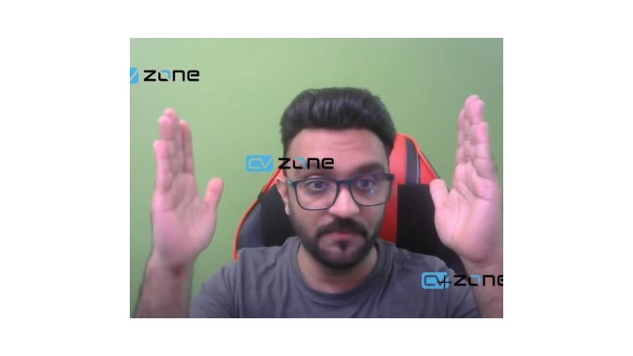
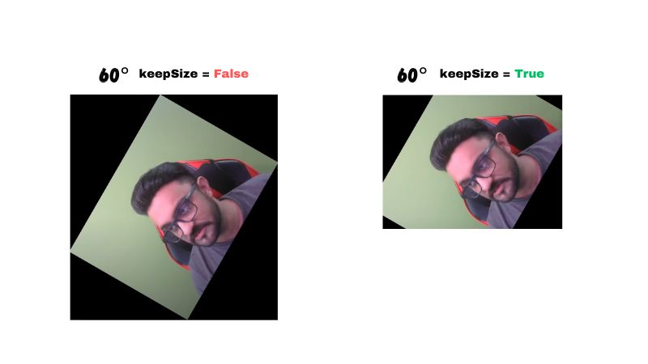
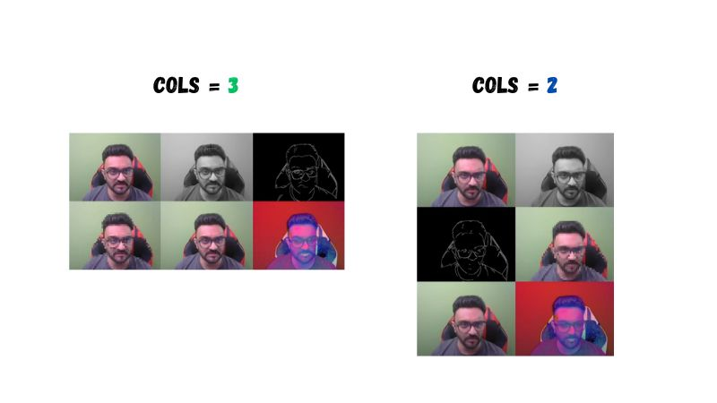

# CVZone

[](https://pepy.tech/project/cvzone)
[](https://pepy.tech/project/cvzone)
[](https://pepy.tech/project/cvzone)


This is a Computer vision package that makes its easy to run Image processing and AI functions. At the core it uses [OpenCV](https://github.com/opencv/opencv) and [Mediapipe](https://github.com/google/mediapipe) libraries. 

## Installation
You can  simply use pip to install the latest version of cvzone.

`pip install cvzone`

<hr>

## Examples
For sample usage and examples, please refer to the Examples folder in this repository. This folder contains various examples to help you understand how to make the most out of cvzone's features.

## Video Documentation

[](https://youtu.be/ieXQTtQgyo0)


## Table of Contents

1. [Installations](#installations)
2. [Corner Rectangle](#corner-rectangle)
3. [PutTextRect](#puttextrect)
4. [Download Image from URL](#download-image-from-url)
5. [Overlay PNG](#overlay-png)
6. [Rotate Image](#rotate-image)
7. [Stack Images](#stack-images)
8. [FPS](#fps)
9. [Finding Contours](#finding-contours)
10. [Color Module](#color-module)
11. [Classification Module](#classification-module)
12. [Face Detection](#face-detection)
13. [Face Mesh Module](#face-mesh-module)
14. [Selfie Segmentation Module](#selfie-segmentation-module)
15. [Hand Tracking Module](#hand-tracking-module)
16. [Pose Module](#pose-module)
17. [Serial Module](#serial-module)
18. [Plot Module](#plot-module)

---

### Installations

To install the cvzone package, run the following command:

```bash
pip install cvzone
```


### Corner Rectangle

<div align="center">
  
</div>

```python

import cv2
import cvzone  # Importing the cvzone library

# Initialize the webcam
cap = cv2.VideoCapture(2)  # Capture video from the third webcam (0-based index)

# Main loop to continuously capture frames
while True:
    # Capture a single frame from the webcam
    success, img = cap.read()  # 'success' is a boolean that indicates if the frame was captured successfully, and 'img' contains the frame itself

    # Add a rectangle with styled corners to the image
    img = cvzone.cornerRect(
        img,  # The image to draw on
        (200, 200, 300, 200),  # The position and dimensions of the rectangle (x, y, width, height)
        l=30,  # Length of the corner edges
        t=5,  # Thickness of the corner edges
        rt=1,  # Thickness of the rectangle
        colorR=(255, 0, 255),  # Color of the rectangle
        colorC=(0, 255, 0)  # Color of the corner edges
    )

    # Show the modified image
    cv2.imshow("Image", img)  # Display the image in a window named "Image"

    # Wait for 1 millisecond between frames
    cv2.waitKey(1)  # Waits 1 ms for a key event (not being used here)
```

### PutTextRect

<div align="center">
  
</div>

```python

import cv2
import cvzone  # Importing the cvzone library

# Initialize the webcam
cap = cv2.VideoCapture(2)  # Capture video from the third webcam (0-based index)

# Main loop to continuously capture frames
while True:
    # Capture a single frame from the webcam
    success, img = cap.read()  # 'success' is a boolean that indicates if the frame was captured successfully, and 'img' contains the frame itself

    # Add a rectangle and put text inside it on the image
    img, bbox = cvzone.putTextRect(
        img, "CVZone", (50, 50),  # Image and starting position of the rectangle
        scale=3, thickness=3,  # Font scale and thickness
        colorT=(255, 255, 255), colorR=(255, 0, 255),  # Text color and Rectangle color
        font=cv2.FONT_HERSHEY_PLAIN,  # Font type
        offset=10,  # Offset of text inside the rectangle
        border=5, colorB=(0, 255, 0)  # Border thickness and color
    )

    # Show the modified image
    cv2.imshow("Image", img)  # Display the image in a window named "Image"

    # Wait for 1 millisecond between frames
    cv2.waitKey(1)  # Waits 1 ms for a key event (not being used here)
```

### Download Image from URL

```python
import cv2
import cvzone

imgNormal = cvzone.downloadImageFromUrl(
    url='https://github.com/cvzone/cvzone/blob/master/Results/shapes.png?raw=true')

imgPNG = cvzone.downloadImageFromUrl(
    url='https://github.com/cvzone/cvzone/blob/master/Results/cvzoneLogo.png?raw=true',
    keepTransparency=True)
imgPNG =cv2.resize(imgPNG,(0,0),None,3,3)

cv2.imshow("Image Normal", imgNormal)
cv2.imshow("Transparent Image", imgPNG)
cv2.waitKey(0)

```

### Overlay PNG

<div align="center">
  
</div>

```python
import cv2
import cvzone

# Initialize camera capture
cap = cv2.VideoCapture(2)

# imgPNG = cvzone.downloadImageFromUrl(
#     url='https://github.com/cvzone/cvzone/blob/master/Results/cvzoneLogo.png?raw=true',
#     keepTransparency=True)

imgPNG = cv2.imread("cvzoneLogo.png",cv2.IMREAD_UNCHANGED)


while True:
    # Read image frame from camera
    success, img = cap.read()

    imgOverlay = cvzone.overlayPNG(img, imgPNG, pos=[-30, 50])
    imgOverlay = cvzone.overlayPNG(img, imgPNG, pos=[200, 200])
    imgOverlay = cvzone.overlayPNG(img, imgPNG, pos=[500, 400])

    cv2.imshow("imgOverlay", imgOverlay)
    cv2.waitKey(1)
```
### Rotate Image

<div align="center">
  
</div>

```python
import cv2
from cvzone.Utils import rotateImage  # Import rotateImage function from cvzone.Utils

# Initialize the video capture
cap = cv2.VideoCapture(2)  # Capture video from the third webcam (index starts at 0)

# Start the loop to continuously get frames from the webcam
while True:
    # Read a frame from the webcam
    success, img = cap.read()  # 'success' will be True if the frame is read successfully, 'img' will contain the frame

    # Rotate the image by 60 degrees without keeping the size
    imgRotated60 = rotateImage(img, 60, scale=1,
                               keepSize=False)  # Rotate image 60 degrees, scale it by 1, and don't keep original size

    # Rotate the image by 60 degrees while keeping the size
    imgRotated60KeepSize = rotateImage(img, 60, scale=1,
                                       keepSize=True)  # Rotate image 60 degrees, scale it by 1, and keep the original size

    # Display the rotated images
    cv2.imshow("imgRotated60", imgRotated60)  # Show the 60-degree rotated image without keeping the size
    cv2.imshow("imgRotated60KeepSize", imgRotated60KeepSize)  # Show the 60-degree rotated image while keeping the size

    # Wait for 1 millisecond between frames
    cv2.waitKey(1)  # Wait for 1 ms, during which any key press can be detected (not being used here)

```
### Stack Images
<div align="center">
  
</div>

```python
import cv2
import cvzone

# Initialize camera capture
cap = cv2.VideoCapture(2)

# Start an infinite loop to continually capture frames
while True:
    # Read image frame from camera
    success, img = cap.read()

    # Convert the image to grayscale
    imgGray = cv2.cvtColor(img, cv2.COLOR_BGR2GRAY)

    # Resize the image to be smaller (0.1x of original size)
    imgSmall = cv2.resize(img, (0, 0), None, 0.1, 0.1)

    # Resize the image to be larger (3x of original size)
    imgBig = cv2.resize(img, (0, 0), None, 3, 3)

    # Apply Canny edge detection on the grayscale image
    imgCanny = cv2.Canny(imgGray, 50, 150)

    # Convert the image to HSV color space
    imgHSV = cv2.cvtColor(img, cv2.COLOR_BGR2HSV)

    # Create a list of all processed images
    imgList = [img, imgGray, imgCanny, imgSmall, imgBig, imgHSV]

    # Stack the images together using cvzone's stackImages function
    stackedImg = cvzone.stackImages(imgList, 3, 0.7)

    # Display the stacked images
    cv2.imshow("stackedImg", stackedImg)

    # Wait for 1 millisecond; this also allows for keyboard inputs
    cv2.waitKey(1)
```
### FPS

```python
import cvzone
import cv2

# Initialize the FPS class with an average count of 30 frames for smoothing
fpsReader = cvzone.FPS(avgCount=30)

# Initialize the webcam and set it to capture
cap = cv2.VideoCapture(0)
cap.set(cv2.CAP_PROP_FPS, 30)  # Set the frames per second to 30

# Main loop to capture frames and display FPS
while True:
    # Read a frame from the webcam
    success, img = cap.read()

    # Update the FPS counter and draw the FPS on the image
    # fpsReader.update returns the current FPS and the updated image
    fps, img = fpsReader.update(img, pos=(20, 50),
                                bgColor=(255, 0, 255), textColor=(255, 255, 255),
                                scale=3, thickness=3)

    # Display the image with the FPS counter
    cv2.imshow("Image", img)

    # Wait for 1 ms to show this frame, then continue to the next frame
    cv2.waitKey(1)
```
### Finding Contours

```python
import cv2           # Importing the OpenCV library for computer vision tasks
import cvzone       # Importing the cvzone library for additional functionalities
import numpy as np  # Importing NumPy library for numerical operations

# Download an image containing shapes from a given URL
imgShapes = cvzone.downloadImageFromUrl(
    url='https://github.com/cvzone/cvzone/blob/master/Results/shapes.png?raw=true')

# Perform edge detection using the Canny algorithm
imgCanny = cv2.Canny(imgShapes, 50, 150)

# Dilate the edges to strengthen the detected contours
imgDilated = cv2.dilate(imgCanny, np.ones((5, 5), np.uint8), iterations=1)

# Find contours in the image without any corner filtering
imgContours, conFound = cvzone.findContours(
    imgShapes, imgDilated, minArea=1000, sort=True,
    filter=None, drawCon=True, c=(255, 0, 0), ct=(255, 0, 255),
    retrType=cv2.RETR_EXTERNAL, approxType=cv2.CHAIN_APPROX_NONE)

# Find contours in the image and filter them based on corner points (either 3 or 4 corners)
imgContoursFiltered, conFoundFiltered = cvzone.findContours(
    imgShapes, imgDilated, minArea=1000, sort=True,
    filter=[3, 4], drawCon=True, c=(255, 0, 0), ct=(255, 0, 255),
    retrType=cv2.RETR_EXTERNAL, approxType=cv2.CHAIN_APPROX_NONE)

# Display the image with all found contours
cv2.imshow("imgContours", imgContours)

# Display the image with filtered contours (either 3 or 4 corners)
cv2.imshow("imgContoursFiltered", imgContoursFiltered)

# Wait until a key is pressed to close the windows
cv2.waitKey(0)

```
### Color Module

```python
import cvzone
import cv2

# Create an instance of the ColorFinder class with trackBar set to True.
myColorFinder = cvzone.ColorFinder(trackBar=True)

# Initialize the video capture using OpenCV.
# Using the third camera (index 2). Adjust index if you have multiple cameras.
cap = cv2.VideoCapture(2)

# Set the dimensions of the camera feed to 640x480.
cap.set(3, 640)
cap.set(4, 480)

# Custom color values for detecting orange.
# 'hmin', 'smin', 'vmin' are the minimum values for Hue, Saturation, and Value.
# 'hmax', 'smax', 'vmax' are the maximum values for Hue, Saturation, and Value.
hsvVals = {'hmin': 10, 'smin': 55, 'vmin': 215, 'hmax': 42, 'smax': 255, 'vmax': 255}

# Main loop to continuously get frames from the camera.
while True:
    # Read the current frame from the camera.
    success, img = cap.read()

    # Use the update method from the ColorFinder class to detect the color.
    # It returns the masked color image and a binary mask.
    imgOrange, mask = myColorFinder.update(img, hsvVals)

    # Stack the original image, the masked color image, and the binary mask.
    imgStack = cvzone.stackImages([img, imgOrange, mask], 3, 1)

    # Show the stacked images.
    cv2.imshow("Image Stack", imgStack)

    # Break the loop if the 'q' key is pressed.
    if cv2.waitKey(1) & 0xFF == ord('q'):
        break

```
### Classification Module

```python
from cvzone.ClassificationModule import Classifier
import cv2

cap = cv2.VideoCapture(2)  # Initialize video capture
path = "C:/Users/USER/Documents/maskModel/"
maskClassifier = Classifier(f'{path}/keras_model.h5', f'{path}/labels.txt')

while True:
    _, img = cap.read()  # Capture frame-by-frame
    prediction = maskClassifier.getPrediction(img)
    print(prediction)  # Print prediction result
    cv2.imshow("Image", img)
    cv2.waitKey(1)  # Wait for a key press
```
### Face Detection

```python
import cvzone
from cvzone.FaceDetectionModule import FaceDetector
import cv2

# Initialize the webcam
# '2' means the third camera connected to the computer, usually 0 refers to the built-in webcam
cap = cv2.VideoCapture(2)

# Initialize the FaceDetector object
# minDetectionCon: Minimum detection confidence threshold
# modelSelection: 0 for short-range detection (2 meters), 1 for long-range detection (5 meters)
detector = FaceDetector(minDetectionCon=0.5, modelSelection=0)

# Run the loop to continually get frames from the webcam
while True:
    # Read the current frame from the webcam
    # success: Boolean, whether the frame was successfully grabbed
    # img: the captured frame
    success, img = cap.read()

    # Detect faces in the image
    # img: Updated image
    # bboxs: List of bounding boxes around detected faces
    img, bboxs = detector.findFaces(img, draw=False)

    # Check if any face is detected
    if bboxs:
        # Loop through each bounding box
        for bbox in bboxs:
            # bbox contains 'id', 'bbox', 'score', 'center'

            # ---- Get Data  ---- #
            center = bbox["center"]
            x, y, w, h = bbox['bbox']
            score = int(bbox['score'][0] * 100)

            # ---- Draw Data  ---- #
            cv2.circle(img, center, 5, (255, 0, 255), cv2.FILLED)
            cvzone.putTextRect(img, f'{score}%', (x, y - 10))
            cvzone.cornerRect(img, (x, y, w, h))

    # Display the image in a window named 'Image'
    cv2.imshow("Image", img)
    # Wait for 1 millisecond, and keep the window open
    cv2.waitKey(1)
```
### Face Mesh Module

```python
from cvzone.FaceMeshModule import FaceMeshDetector
import cv2

# Initialize the webcam
# '2' indicates the third camera connected to the computer, '0' would usually refer to the built-in webcam
cap = cv2.VideoCapture(2)

# Initialize FaceMeshDetector object
# staticMode: If True, the detection happens only once, else every frame
# maxFaces: Maximum number of faces to detect
# minDetectionCon: Minimum detection confidence threshold
# minTrackCon: Minimum tracking confidence threshold
detector = FaceMeshDetector(staticMode=False, maxFaces=2, minDetectionCon=0.5, minTrackCon=0.5)

# Start the loop to continually get frames from the webcam
while True:
    # Read the current frame from the webcam
    # success: Boolean, whether the frame was successfully grabbed
    # img: The current frame
    success, img = cap.read()

    # Find face mesh in the image
    # img: Updated image with the face mesh if draw=True
    # faces: Detected face information
    img, faces = detector.findFaceMesh(img, draw=True)

    # Check if any faces are detected
    if faces:
        # Loop through each detected face
        for face in faces:
            # Get specific points for the eye
            # leftEyeUpPoint: Point above the left eye
            # leftEyeDownPoint: Point below the left eye
            leftEyeUpPoint = face[159]
            leftEyeDownPoint = face[23]

            # Calculate the vertical distance between the eye points
            # leftEyeVerticalDistance: Distance between points above and below the left eye
            # info: Additional information (like coordinates)
            leftEyeVerticalDistance, info = detector.findDistance(leftEyeUpPoint, leftEyeDownPoint)

            # Print the vertical distance for debugging or information
            print(leftEyeVerticalDistance)

    # Display the image in a window named 'Image'
    cv2.imshow("Image", img)

    # Wait for 1 millisecond to check for any user input, keeping the window open
    cv2.waitKey(1)

```
### Selfie Segmentation Module

```python
import cvzone
from cvzone.SelfiSegmentationModule import SelfiSegmentation
import cv2

# Initialize the webcam. '2' indicates the third camera connected to the computer.
# '0' usually refers to the built-in camera.
cap = cv2.VideoCapture(2)

# Set the frame width to 640 pixels
cap.set(3, 640)
# Set the frame height to 480 pixels
cap.set(4, 480)

# Initialize the SelfiSegmentation class. It will be used for background removal.
# model is 0 or 1 - 0 is general 1 is landscape(faster)
segmentor = SelfiSegmentation(model=0)

# Infinite loop to keep capturing frames from the webcam
while True:
    # Capture a single frame
    success, img = cap.read()

    # Use the SelfiSegmentation class to remove the background
    # Replace it with a magenta background (255, 0, 255)
    # imgBG can be a color or an image as well. must be same size as the original if image
    # 'cutThreshold' is the sensitivity of the segmentation.
    imgOut = segmentor.removeBG(img, imgBg=(255, 0, 255), cutThreshold=0.1)

    # Stack the original image and the image with background removed side by side
    imgStacked = cvzone.stackImages([img, imgOut], cols=2, scale=1)

    # Display the stacked images
    cv2.imshow("Image", imgStacked)

    # Check for 'q' key press to break the loop and close the window
    if cv2.waitKey(1) & 0xFF == ord('q'):
        break

```
### Hand Tracking Module

```python
from cvzone.HandTrackingModule import HandDetector
import cv2

# Initialize the webcam to capture video
# The '2' indicates the third camera connected to your computer; '0' would usually refer to the built-in camera
cap = cv2.VideoCapture(2)

# Initialize the HandDetector class with the given parameters
detector = HandDetector(staticMode=False, maxHands=2, modelComplexity=1, detectionCon=0.5, minTrackCon=0.5)

# Continuously get frames from the webcam
while True:
    # Capture each frame from the webcam
    # 'success' will be True if the frame is successfully captured, 'img' will contain the frame
    success, img = cap.read()

    # Find hands in the current frame
    # The 'draw' parameter draws landmarks and hand outlines on the image if set to True
    # The 'flipType' parameter flips the image, making it easier for some detections
    hands, img = detector.findHands(img, draw=True, flipType=True)

    # Check if any hands are detected
    if hands:
        # Information for the first hand detected
        hand1 = hands[0]  # Get the first hand detected
        lmList1 = hand1["lmList"]  # List of 21 landmarks for the first hand
        bbox1 = hand1["bbox"]  # Bounding box around the first hand (x,y,w,h coordinates)
        center1 = hand1['center']  # Center coordinates of the first hand
        handType1 = hand1["type"]  # Type of the first hand ("Left" or "Right")

        # Count the number of fingers up for the first hand
        fingers1 = detector.fingersUp(hand1)
        print(f'H1 = {fingers1.count(1)}', end=" ")  # Print the count of fingers that are up

        # Calculate distance between specific landmarks on the first hand and draw it on the image
        length, info, img = detector.findDistance(lmList1[8][0:2], lmList1[12][0:2], img, color=(255, 0, 255),
                                                  scale=10)

        # Check if a second hand is detected
        if len(hands) == 2:
            # Information for the second hand
            hand2 = hands[1]
            lmList2 = hand2["lmList"]
            bbox2 = hand2["bbox"]
            center2 = hand2['center']
            handType2 = hand2["type"]

            # Count the number of fingers up for the second hand
            fingers2 = detector.fingersUp(hand2)
            print(f'H2 = {fingers2.count(1)}', end=" ")

            # Calculate distance between the index fingers of both hands and draw it on the image
            length, info, img = detector.findDistance(lmList1[8][0:2], lmList2[8][0:2], img, color=(255, 0, 0),
                                                      scale=10)

        print(" ")  # New line for better readability of the printed output

    # Display the image in a window
    cv2.imshow("Image", img)

    # Keep the window open and update it for each frame; wait for 1 millisecond between frames
    cv2.waitKey(1)
```
### Pose Module

```python
from cvzone.PoseModule import PoseDetector
import cv2

# Initialize the webcam and set it to the third camera (index 2)
cap = cv2.VideoCapture(2)

# Initialize the PoseDetector class with the given parameters
detector = PoseDetector(staticMode=False,
                        modelComplexity=1,
                        smoothLandmarks=True,
                        enableSegmentation=False,
                        smoothSegmentation=True,
                        detectionCon=0.5,
                        trackCon=0.5)

# Loop to continuously get frames from the webcam
while True:
    # Capture each frame from the webcam
    success, img = cap.read()

    # Find the human pose in the frame
    img = detector.findPose(img)

    # Find the landmarks, bounding box, and center of the body in the frame
    # Set draw=True to draw the landmarks and bounding box on the image
    lmList, bboxInfo = detector.findPosition(img, draw=True, bboxWithHands=False)

    # Check if any body landmarks are detected
    if lmList:
        # Get the center of the bounding box around the body
        center = bboxInfo["center"]

        # Draw a circle at the center of the bounding box
        cv2.circle(img, center, 5, (255, 0, 255), cv2.FILLED)

        # Calculate the distance between landmarks 11 and 15 and draw it on the image
        length, img, info = detector.findDistance(lmList[11][0:2],
                                                  lmList[15][0:2],
                                                  img=img,
                                                  color=(255, 0, 0),
                                                  scale=10)

        # Calculate the angle between landmarks 11, 13, and 15 and draw it on the image
        angle, img = detector.findAngle(lmList[11][0:2],
                                        lmList[13][0:2],
                                        lmList[15][0:2],
                                        img=img,
                                        color=(0, 0, 255),
                                        scale=10)

        # Check if the angle is close to 50 degrees with an offset of 10
        isCloseAngle50 = detector.angleCheck(myAngle=angle,
                                             targetAngle=50,
                                             offset=10)

        # Print the result of the angle check
        print(isCloseAngle50)

    # Display the frame in a window
    cv2.imshow("Image", img)

    # Wait for 1 millisecond between each frame
    cv2.waitKey(1)
```
### Serial Module

```python
from cvzone.SerialModule import SerialObject

# Initialize the Arduino SerialObject with optional parameters
# baudRate = 9600, digits = 1, max_retries = 5
arduino = SerialObject(portNo=None, baudRate=9600, digits=1, max_retries=5)

# Initialize a counter to keep track of iterations
count = 0

# Start an infinite loop
while True:
    # Increment the counter on each iteration
    count += 1

    # Print data received from the Arduino
    # getData method returns the list of data received from the Arduino
    print(arduino.getData())

    # If the count is less than 100
    if count < 100:
        # Send a list containing [1] to the Arduino
        arduino.sendData([1])
    else:
        # If the count is 100 or greater, send a list containing [0] to the Arduino
        arduino.sendData([0])

    # Reset the count back to 0 once it reaches 200
    # This will make the cycle repeat
    if count == 200:
        count = 0

```
```cpp
#include <cvzone.h>

SerialData serialData(1,1); //(numOfValsRec,digitsPerValRec)
/*0 or 1 - 1 digit
0 to 99 -  2 digits
0 to 999 - 3 digits
 */
//SerialData serialData;   // if not receving only sending


int sendVals[2]; // min val of 2 even when sending 1
int valsRec[1];

int x = 0;

void setup() {

serialData.begin(9600);
pinMode(13,OUTPUT);
}

void loop() {

  // ------- To SEND --------
  x +=1;
  if (x==100){x=0;}
  sendVals[0] = x;
  serialData.Send(sendVals);

  // ------- To Recieve --------
  serialData.Get(valsRec);
  digitalWrite(13,valsRec[0]);

}
```


### Plot Module
#### Sine Example 
```python
from cvzone.PlotModule import LivePlot
import cv2
import math


sinPlot = LivePlot(w=1200, yLimit=[-100, 100], interval=0.01)
xSin=0

while True:

    xSin += 1
    if xSin == 360: xSin = 0
    imgPlotSin = sinPlot.update(int(math.sin(math.radians(xSin)) * 100))

    cv2.imshow("Image Sin Plot", imgPlotSin)

    if cv2.waitKey(1) & 0xFF == ord('q'):
        break

```

#### Face Detection X Value Example
```python
from cvzone.PlotModule import LivePlot
from cvzone.FaceDetectionModule import FaceDetector
import cv2
import cvzone

cap = cv2.VideoCapture(1)
detector = FaceDetector(minDetectionCon=0.85, modelSelection=0)

xPlot = LivePlot(w=1200, yLimit=[0, 500], interval=0.01)

while True:
    success, img = cap.read()

    img, bboxs = detector.findFaces(img, draw=False)
    val = 0
    if bboxs:
        # Loop through each bounding box
        for bbox in bboxs:
            # bbox contains 'id', 'bbox', 'score', 'center'
            # ---- Get Data  ---- #
            center = bbox["center"]
            x, y, w, h = bbox['bbox']
            score = int(bbox['score'][0] * 100)
            val = center[0]
            # ---- Draw Data  ---- #
            cv2.circle(img, center, 5, (255, 0, 255), cv2.FILLED)
            cvzone.putTextRect(img, f'{score}%', (x, y - 10))
            cvzone.cornerRect(img, (x, y, w, h))

    imgPlot = xPlot.update(val)

    cv2.imshow("Image Plot", imgPlot)
    cv2.imshow("Image", img)

    if cv2.waitKey(1) & 0xFF == ord('q'):
        break

```